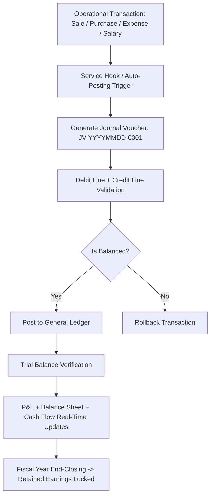

# 📦 iTech Inventory — Deep Project Analysis

> **App Name:** Bedouin (configured in `.env` as `APP_NAME`)
> **Framework:** Laravel 10.x
> **PHP Requirement:** ^8.1 / PHP 8.2+ / PHP 8.3
> **Database:** MySQL (`itech_inventory`)
> **Environment:** Local (Laragon / `127.0.0.1:8000`)
> **Last Migration Date:** August 2026 (Double-Entry Bookkeeping & Accounts)

---

## 1. 🗂️ Project Overview

**iTech Inventory** is a comprehensive, multi-module business ERP & inventory management system built on **Laravel 10**. Despite the project folder name (`itech inventory`), the app is branded internally as **"Bedouin"**. It is a **full-stack monolithic web application** that covers:

- **Double-Entry Accounting & Bookkeeping** (5-Class Chart of Accounts, Journal Entries, Ledger, Trial Balance, P&L, Balance Sheet, Cash Flow, Contra Transfers, Bank Reconciliation, Fiscal Year Closing)
- **Inventory & Product Management** (Serialized & Bulk stock tracking, multi-category taxonomy, warranties)
- **Sales, Purchase & Returns** (Multi-channel sales, procurement, warranty claims, auto-journal triggers)
- **Service Management** (Repair ticketing, workshop tracking, technician ratings, service invoicing)
- **Project Management** (Project items, direct costing, budgeting, milestone billing)
- **HR & Payroll Module** (Employees, monthly salary disbursements, attendance, employee TA/DA self-service portal)
- **Financial Documents** (Dynamic invoice generation, Bill & Challan generators, Quotations with PDF/mPDF export)
- **Client, Customer & Vendor Management** (Comprehensive CRM & Supplier portals)
- **Role-Based Access Control (RBAC)** (Spatie Permission integration with Super Admin & Employee roles)
- **Reports & Analytics** (Real-time financial performance, revenue exports, sales & purchase audits)
- **Real-time Notifications** (Pusher WebSockets & Twilio SMS integration)

---

## 2. 🏗️ Architecture

```
itech inventory/
├── app/
│   ├── Console/Commands/  # Artisan commands (e.g., accounts:init-balances)
│   ├── Events/            # Real-time WebSocket events (e.g., SaleCreatedEvent)
│   ├── Exceptions/        # Custom exception handlers
│   ├── Helpers/
│   │   ├── helpers.php        # Global accounting & utility helpers (postJournalEntry, getAccountBalance, etc.)
│   │   └── NumberToWords.php  # Number to words converter (for invoices and vouchers)
│   ├── Http/
│   │   ├── Controllers/   # 54 controllers (Sales, Accounts, Purchases, Service, HR, etc.)
│   │   ├── Middleware/    # ValidateFiscalYear, Spatie RBAC, auth guards
│   │   └── Kernel.php
│   ├── Mail/              # Mailable classes (e.g., CreateSalesMail)
│   ├── Models/            # 54 Eloquent models (ChartOfAccount, JournalEntry, Sale, Product, etc.)
│   ├── Providers/
│   └── Services/          # Dedicated business services (SaleService, PurchaseService, InventoryService, WarrantyService)
├── database/
│   ├── migrations/        # 75 database migrations
│   ├── factories/
│   └── seeders/           # ChartOfAccountSeeder, Role & Permission seeders
├── resources/
│   ├── views/
│   │   ├── frontend/      # Admin ERP views (Blade templates)
│   │   │   ├── layouts/   # master, sidebar, header, footer
│   │   │   └── pages/     # 38 module sections including /accounts/
│   │   ├── pdf/           # mPDF & DomPDF invoice, voucher, and ledger templates
│   │   │   └── accounts/  # Voucher, Ledger, Trial Balance, P&L, Balance Sheet templates
│   │   ├── auth/
│   │   └── errors/
│   ├── css/, js/, sass/
├── routes/
│   ├── web.php            # Main role-protected routes (310 routes)
│   ├── __web.php          # Legacy route archive
│   ├── api.php            # API endpoints
│   └── console.php
├── public/                # Assets, final_pad.png letterhead backgrounds, uploads
├── config/                # App, auth, permission, pdf configurations
└── storage/
```

### Architecture Patterns & Principles
- **MVC Architecture** — Strict separation between Eloquent Models, Blade Views, and Controllers.
- **Service Layer Pattern** — Complex transactions isolated into dedicated services (`SaleService`, `PurchaseService`, `InventoryService`, `WarrantyService`) with database transaction safety.
- **Double-Entry Accounting Engine** — Self-balancing journal voucher posting with debit/credit equilibrium guarantees, Storno error corrections, and strict fiscal period guards.
- **Dual PDF Engine** — High-performance vector PDF rendering with `carlos-meneses/laravel-mpdf` for financial reports and invoices using authenticated signature blocks and base64 letterhead pads.

---

## 3. 🔑 Authentication & Authorization

### Authentication
- Built on `laravel/ui` (Bootstrap authentication scaffolding).
- **Public registration disabled** → `Auth::routes(['register' => false, 'reset' => false, 'verify' => false])`.
- Secondary PIN-based administrative authorization (`/user/pin`).
- `laravel/sanctum` installed for secure internal/external API token authorization.

### Authorization — Spatie Role-Based Access Control (RBAC)
Managed by **Spatie Laravel Permission** (`spatie/laravel-permission ^6.3`):

| Role | Access Scope |
|------|--------------|
| **Super Admin / Admin** | Full access to all 38 modules, including Double-Entry Accounting, HR Payroll, System Security, and Financial Reports |
| **Employee** | Dashboard view + personal TA/DA self-service submission portal |

**Route Middleware Structure:**
```php
// Group 1: Dashboard + Employee TA/DA Portal (Super Admin & Employee)
Route::middleware(['auth', 'role:Super Admin|Employee'])->group(...);

// Group 2: Full ERP Modules & Double-Entry Accounting (Super Admin only)
Route::middleware(['auth', 'role:Super Admin'])->group(...);
```

---

## 4. 📊 Modules & Features

### 4.1 📒 Double-Entry Accounting & Bookkeeping (New)
A complete, GAAP/IFRS-compliant double-entry accounting engine fully integrated with operational transactions.

| Model | Table | Purpose |
|-------|-------|---------|
| `ChartOfAccount` | `chart_of_accounts` | Recursive parent-child account tree across 5 standard classes: Asset (1000), Liability (2000), Equity (3000), Revenue (4000), Expense (5000). Linked to `BankDetail`. |
| `FiscalYear` | `fiscal_years` | Financial accounting periods with start/end dates, active status flag, and year-end closing locks. |
| `JournalEntry` | `journal_entries` | Immutable voucher headers with auto-sequencing `JV-YYYYMMDD-0001`, audit metadata, and Storno reversal foreign keys. |
| `JournalEntryItem` | `journal_entry_items` | Split debit and credit transaction lines with individual account allocations. |
| `ContraEntry` | `contra_entries` | Internal liquid fund transfers (Cash-to-Bank, Bank-to-Bank) with auto `CN-YYYYMMDD-0001` sequencing. |
| `AccountReconciliation` | `account_reconciliations` | Bank statement balance verification and variance tracking against General Ledger book balances. |

#### Core Accounting Features:
- **Master Chart of Accounts**: 39 pre-seeded standard accounts with normal balance rules (`isDebitNormal()`) and recursive child balance calculations.
- **Journal Vouchers (JV)**: Interactive multi-row split debit/credit creator with real-time dynamic JavaScript equilibrium validation.
- **General Ledger**: Chronological transaction audit trail with running balances, opening balance brought forward, date filters, and PDF export.
- **Trial Balance**: Automatic debit vs. credit balance validation verifying equation equilibrium across all active accounts.
- **Financial Statements**:
  - **Profit & Loss (P&L)**: Operating revenues (4000) minus operating expenses (5000) calculating Net Period Profit/Loss.
  - **Balance Sheet**: Fundamental accounting equation verification: $\text{Assets (1000)} = \text{Liabilities (2000)} + \text{Equity (3000)} + \text{Current Retained Earnings}$.
  - **Cash Flow Statement**: Net liquid operating fund changes derived from Cash in Hand (1110) and Bank (1120).
- **Contra Transfers**: Atomic dual-legged transfers crediting source liquid account and debiting destination account.
- **Bank Reconciliation**: Statement cutoff date matching comparing bank statement balances against system book balances.
- **Fiscal Year Closing**: One-click year-end closing that automatically zeroes out temporary Revenue and Expense accounts into Owner Capital/Retained Earnings (`3100`/`3200`) and permanently locks the period.
- **Auto-Posting Triggers**: Operational hooks in `SaleService`, `PurchaseService`, `ExpenseController`, `SalaryController`, `ServiceController`, and `ReturnController` automatically generate double-entry vouchers upon transaction execution.

---

### 4.2 🛒 Product & Inventory Management
| Model | Table | Key Fields & Capabilities |
|-------|-------|--------------------------|
| `Product` | `products` | `name`, `category_id`, `brand_id`, `model`, `photos` (JSON), `warranty`, `is_serialized` |
| `Inventory` | `inventories` | `product_id`, `opening_stock`, `current_stock` |
| `ProductSerial` | `product_serials` | Unique alphanumeric serial tracking per unit for warranty verification |
| `Category` | `categories` | Product categorization and taxonomy |
| `Brand` | `brands` | Brand and manufacturer management |

---

### 4.3 💰 Sales Module
| Model | Table | Key Fields & Capabilities |
|-------|-------|--------------------------|
| `Sale` | `sales` | `order_no` (`INV-...`), `customer_id`, `total`, `payble`, `advanced_payment`, `due_payment`, `discount`, `vat`, `tax`, `delivery_charge`, `status` |
| `SalesItem` | `sales_items` | `product_id`, `unit_price`, `purchase_price`, `profit`, `qty`, `returned_qty` |
| `Customer` | `customers` | Retail customer CRM |
| `Payment` | `payments` | Transaction records linked to sales with audit tracking |

- Auto-deducts inventory on sale creation.
- Real-time WebSocket broadcasting via `SaleCreatedEvent` (Pusher).
- Auto-posts double-entry vouchers recognizing Revenue (4110), Cash (1110), and Accounts Receivable (1130).

---

### 4.4 🛍️ Purchase & Procurement Module
| Model | Table | Key Fields & Capabilities |
|-------|-------|--------------------------|
| `Purchase` | `purchases` | `product_id`, `vendor_id`, `quantity`, `unit_price`, `sub_price`, `total_price`, `payment`, `due` |
| `Vendor` | `vendors` | Supplier profiles with contact and company info |

- Auto-increments warehouse inventory stock.
- Bulk and individual serial number registration for serialized products.
- Auto-posts double-entry vouchers recognizing Inventory Asset (1140), Cash (1110), and Accounts Payable (2110).

---

### 4.5 🔄 Product Returns & Refunds
| Model | Table | Key Fields & Capabilities |
|-------|-------|--------------------------|
| `ProductReturn` | `returns` | `sale_id`, `customer_id`, `return_date`, `total_refund_amount`, `status`, `reason` |
| `ReturnItem` | `return_items` | `product_id`, `quantity`, `unit_price`, `condition`, `return_reason` |

- Workflow: `pending` $\rightarrow$ `approve()` $\rightarrow$ `complete()`.
- On completion: Restocks inventory, reduces sale receivable/payable, creates negative refund payment, and posts double-entry reversal.

---

### 4.6 🔧 Service & Workshop Management
| Model | Table | Key Fields & Capabilities |
|-------|-------|--------------------------|
| `Service` | `services` | `customer_id`, `product_name`, `product_number`, `details`, `total`, `bill`, `paid_amount`, `due_amount`, `warranty_duration`, `repaired_by`, `status` |
| `RatingReview` | `rating_reviews` | Technician rating and customer service feedback |

- Service ticketing and repair lifecycle tracking.
- Generates dedicated service invoices and receipts with double-entry Service Revenue (4120) recording.

---

### 4.7 📁 Project Management & Direct Costing
| Model | Table | Key Fields & Capabilities |
|-------|-------|--------------------------|
| `Project` | `projects` | `project_name`, `client_id`, `budget`, `sub_total`, `discount`, `grand_total`, `advanced_payment`, `due_payment`, `status` |
| `ProjectItem` | `project_items` | Materials and items allocated to the project |
| `ProjectCost` | `project_costs` | Direct project cost line items linked to `CostCategory` |
| `Client` | `clients` | Corporate client CRM |

- Tracks project budgeting vs. actual cost incurred.
- Milestone billing and project bill generation.
- Auto-posts Direct Project Cost expenses (5230) to the General Ledger.

---

### 4.8 📄 Commercial & Billing Documents
- **Bills (`Bill` / `BillItem`)**: Supports `project`, `sale`, `purchase`, `vendor`, and `general` billing formats with `{PREFIX}-{YYYYMMDD}-{0001}` numbering.
- **Challans (`Challan` / `ChallanItem`)**: Delivery goods dispatch notes with recipient details and corporate letterheads.
- **Quotations (`Quotation` / `QuotationItem`)**: Client price proposals with expiration tracking, terms and conditions, and one-click PDF generation.

---

### 4.9 👨‍💼 HR & Payroll Management
| Model | Table | Key Fields & Capabilities |
|-------|-------|--------------------------|
| `Employee` | `employees` | `employee_id`, `user_id`, `name`, `email`, `phone`, `designation`, `join_date`, `salary`, `image` |
| `Salary` | `salaries` | Monthly payroll calculation (`basic_salary + allowance - deduction - advance`) |
| `AdvanceSalary` | `advance_salaries` | Staff advance salary requests |
| `Attendance` | `attendances` | Daily staff attendance logging |
| `TaDa` | `ta_das` | Travel Allowance & Daily Allowance entries |

- Self-service Employee portal for TA/DA claim submission.
- Monthly salary disbursement posting to Salary Expense (5210).

---

### 4.10 🏦 Company Profiles & Bank Accounts
- **`CompanyDetail`**: Multi-branch corporate details, logo, signature image, seal image, and letterhead configurations.
- **`BankDetail`**: Multi-bank account profiles linked directly to Chart of Accounts (1120) with default account selection.

---

## 5. 🗄️ Database Schema Summary

> **Total Migrations:** 75
> **Database:** MySQL (`itech_inventory`)

### Comprehensive Table Inventory

| Category | Tables |
|----------|--------|
| **Core & RBAC** | `users`, `roles`, `permissions`, `model_has_roles`, `model_has_permissions`, `role_has_permissions`, `activity_logs`, `notifications` |
| **Double-Entry Accounting** | `chart_of_accounts`, `fiscal_years`, `journal_entries`, `journal_entry_items`, `contra_entries`, `account_reconciliations` |
| **Catalog & Stock** | `products`, `product_serials`, `categories`, `brands`, `inventories` |
| **Sales & CRM** | `sales`, `sales_items`, `customers`, `clients`, `payments`, `revenues` |
| **Procurement** | `purchases`, `vendors` |
| **Returns & Warranty** | `returns`, `return_items`, `warranty_claims`, `warranty_claim_logs` |
| **Service Workshop** | `services`, `rating_reviews` |
| **Projects & Costs** | `projects`, `project_items`, `project_costs`, `cost_categories` |
| **Billing Documents** | `bills`, `bill_items`, `challans`, `challan_items`, `quotations`, `quotation_items` |
| **HR & Payroll** | `employees`, `salaries`, `advance_salaries`, `attendances`, `ta_das` |
| **Company & Banking** | `company_details`, `bank_details`, `daily_expenses`, `expense_categories` |

---

## 6. 📦 Key Dependencies & Technology Stack

### Backend
| Package | Version | Purpose |
|---------|---------|---------|
| `laravel/framework` | ^10.10 | Core framework |
| `laravel/ui` | ^4.4 | Bootstrap auth scaffolding |
| `laravel/sanctum` | ^3.3 | API token authentication |
| `spatie/laravel-permission` | ^6.3 | Role-Based Access Control |
| `carlos-meneses/laravel-mpdf` | ^2.1 | High-precision vector PDF generation with custom letterhead pads |
| `barryvdh/laravel-dompdf` | ^3.1 | Secondary PDF export utilities |
| `cviebrock/eloquent-sluggable` | ^10.0 | SEO slug generation |
| `guzzlehttp/guzzle` | ^7.8 | HTTP client |
| `pusher/pusher-php-server` | ^7.2 | Real-time WebSocket notifications |
| `twilio/sdk` | ^8.3 | SMS notifications |
| `anhskohbo/no-captcha` | ^3.6 | Google reCAPTCHA v2/v3 |
| `paytrail/paytrail-php-sdk` | ^2.7 | Payment gateway integration |

### Frontend
- **Blade Templating Engine** with reusable layouts and nested components
- **Bootstrap 5 & Feathers Icons (`fe fe-*`) / FontAwesome 5/6 (`fas fa-*`)**
- **Vanilla JavaScript** with dynamic DOM calculators for journal split lines, balance reconciliations, and live equilibrium checks
- **Vite** asset bundling

---

## 7. 🛣️ Route Groups Summary (310 Total Routes)

| Prefix / Route Group | Primary Controller | Functionality |
|----------------------|--------------------|---------------|
| `/` | `FrontendController` | Main administrative dashboard |
| `accounts/*` | `ChartOfAccountController`, `JournalEntryController`, `LedgerController`, `TrialBalanceController`, `FinancialStatementController`, `ContraEntryController`, `ReconciliationController`, `FiscalYearController` | Full Double-Entry Accounting module (32 routes) |
| `sales/*` | `SalesController` | Sales orders, invoice generation, due payment processing, reports |
| `purchase/*` | `PurchaseController` | Procurement entries, latest purchase price queries, purchase reports |
| `inventory/*` | `InventoryController`, `ProductSerialController` | Stock monitoring, serial lookups, PDF inventory list |
| `service/*` | `ServiceController`, `PaymentController` | Workshop repair ticketing, completion, rating submissions, invoice PDFs |
| `projects/*` | `ProjectController`, `ProjectItemController`, `ProjectCostController`, `ProjectBillController` | Projects, bill creations, milestone payments |
| `bills/*`, `challans/*`, `quotations/*` | `BillController`, `ChallanController`, `QuotationController` | Document generators with PDF export |
| `product-returns/*` | `ReturnController` | Return lifecycle management (create, approve, complete, reject) |
| `employees/*`, `salary/*`, `ta-da/*` | `EmployeeController`, `SalaryController`, `TaDaController` | HR staff management, monthly salary run, TA/DA approvals |
| `employee/tada/*` | `EmployeeTaDaController` | Employee portal for self-service TA/DA entry |
| `users/*`, `role/*`, `permission/*` | `UserController`, `RoleController`, `PermissionController` | System security, user profiles, PIN settings |
| `bank-details/*`, `company-details/*` | `BankDetailController`, `CompanyDetailController` | Company configuration and default bank selection |
| `daily-expenses/*`, `expense-categories/*` | `ExpenseController`, `ExpenseCategoryController` | Operational daily expenses |

---

## 8. 🔄 Core Business Workflows

### Double-Entry Accounting Flow


### Integrated Sales & Revenue Flow
```
Create Sale -> Deduct Inventory Stock -> Post JV (Debit Cash/AR, Credit Sales Revenue) -> Generate Invoice PDF -> Collect Due Payment -> Settle AR
```

### Procurement & Inventory Flow
```
Create Purchase -> Add Warehouse Stock -> Register Serial Numbers -> Post JV (Debit Inventory Asset, Credit Cash/AP) -> Settle AP
```

### Product Return & Refund Flow
```
Submit Return Request -> Approve Return -> Complete Return -> Restock Stock -> Issue Refund -> Post Reversal JV (Debit Sales Revenue, Credit Cash)
```

---

## 9. 📋 Setup & Deployment Guide

```bash
# 1. Clone repository and install dependencies
composer install
npm install

# 2. Configure environment file
cp .env.example .env
php artisan key:generate

# 3. Configure Database (.env)
DB_CONNECTION=mysql
DB_HOST=127.0.0.1
DB_PORT=3306
DB_DATABASE=itech_inventory
DB_USERNAME=root
DB_PASSWORD=

# 4. Run database migrations
php artisan migrate

# 5. Seed initial data (Roles, Permissions, Master Chart of Accounts)
php artisan db:seed
php artisan db:seed --class=ChartOfAccountSeeder

# 6. Initialize operational opening balances (AR, Inventory, AP, Equity)
php artisan accounts:init-balances

# 7. Build assets and run
npm run build
php artisan serve
```

> **Default Local Server:** `http://127.0.0.1:8000`

---

*Document updated: August 2026*
*Maintained by: Antigravity AI Engineering Assistant*
